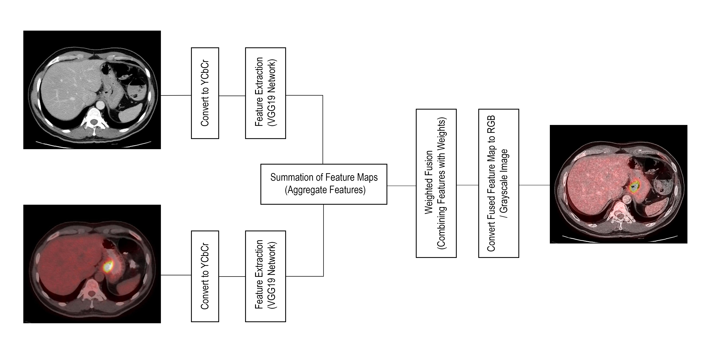

# Medical Image Fusion Project



## Overview

This project focuses on medical image fusion, a technique used to integrate information from multiple medical images into a single composite image, enhancing diagnostic accuracy and aiding medical professionals in making informed decisions. The fusion process combines complementary information from different modalities, such as MRI, CT, PET, and ultrasound, to produce a fused image with improved visibility of relevant anatomical structures and pathologies.

## Features

- **Image Fusion**: Utilizes advanced image fusion algorithms, including VGG19-based fusion, to integrate information from multiple medical images.
- **Evaluation Metrics**: Provides evaluation metrics such as PSNR, SSIM, entropy, mutual information, MSE, and RMSE to assess the quality and effectiveness of the fused images.
- **Batch Processing**: Supports batch processing of image fusion, allowing users to fuse multiple pairs of medical images simultaneously.
- **Flexible Input**: Accepts input images in various formats and modalities, enabling fusion of images from different medical imaging devices and modalities.
- **Easy-to-Use Interface**: Simple command-line interface with configurable options for input directories, output directory, and fusion parameters.

## Requirements

Ensure you have the following dependencies installed:

- Python 3.11
- Required Python packages (specified in `requirements.txt`)

## Installation

1. Clone the repository:

   ```bash
   git clone https://github.com/prabhatpps/Medical_image_fusion_using_VGG19.git

2. Install dependencies::

   ```bash
   pip install -r requirements.txt
   

## Usage
1. Navigate to the project directory:

   ```bash
   cd medical-image-fusion

2. Run the main script:

   ```bash
   python main.py
   
## Results

The fused images will be saved in the output directory specified. Evaluation metrics will be printed for each pair of images.

## License

,,,,,,,,

## Acknowledgements

- [OpenCV](https://opencv.org/)
- [PyTorch](https://pytorch.org/)
- [scikit-image](https://scikit-image.org/)
- [NumPy](https://numpy.org/)

## Author

Prabhat Pandey

